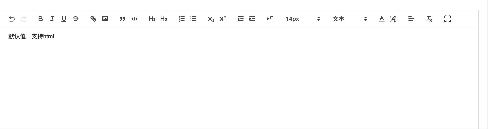

### 富文本编辑器quill的使用

#### 使用
```js
import React, { useEffect, useRef, useState } from 'react'
import T from 'prop-types'
import 'quill/dist/quill.snow.css'
import { Upload } from 'antd'
import Quill from 'quill'
import MoziDataSource from '@wac/mozi-data-source'

import ImageResize from 'quill-image-resize-module'
import { FullScreen, useFullScreenHandle } from 'react-full-screen'

import { fontSizePx } from './constants'
import axios from './axios'
import './index.less'
import undo from './images/undo.js'
import redo from './images/redo.js'
import max from './images/max'
import min from './images/min'

Quill.register('modules/imageResize', ImageResize)

Quill.imports['attributors/style/size'].whitelist = fontSizePx
Quill.register(Quill.imports['attributors/style/size'])

var icons = Quill.import('ui/icons')

icons['undo'] = undo
icons['redo'] = redo
icons['maxScreen'] = max
icons['minScreen'] = min
export default function Editor(props) {
  const [quillEditor, setquillEditor] = useState(null)
  const [isFull, setIsFull] = useState(false) // 是否全屏
  let reactQuillRef = useRef(null)
  const handle = useFullScreenHandle()

  // 上传图片
  const imageHandler = async () => {
    const input = document.getElementById('upload')
    input.click()
  }

  const customRequest = (params, editor) => {
    const { file, onError } = params
    const formData = new FormData()
    formData.append('file', file)
    MoziDataSource.proxy({
      axiosConfig: {
        method: 'post',
        url: `上传的url`,
        data: formData,
        headers: { 'Content-Type': 'multipart/form-data' },
      },
      axios,
    })
      .then(res => {
        const url = res
        const myEditor = editor || quillEditor
        const range = myEditor.getSelection()
        myEditor.insertEmbed(range.index, 'image', url)
      })
      .catch(() => onError)
  }

  useEffect(() => {
    const editor = new Quill('#quill-editor', {
      theme: 'snow',
      modules: {
        // 调整图片大小
        imageResize: {
          modules: ['Resize', 'DisplaySize'],
        },
        toolbar: {
          container: [
            ['undo', 'redo'], // 撤销 重做
            ['bold', 'italic', 'underline', 'strike'], // toggled buttons
            ['link', 'image'],
            ['blockquote', 'code-block'],

            [{ header: 1 }, { header: 2 }], // custom button values
            [{ list: 'ordered' }, { list: 'bullet' }],
            [{ script: 'sub' }, { script: 'super' }], // superscript/subscript
            [{ indent: '-1' }, { indent: '+1' }], // outdent/indent
            [{ direction: 'rtl' }], // text direction

            [{ size: fontSizePx }], // custom dropdown
            [{ header: [1, 2, 3, 4, 5, 6, false] }],

            [{ color: [] }, { background: [] }], // dropdown with defaults from theme
            [{ align: [] }],

            ['clean'],
            ['maxScreen', 'minScreen'],
          ],
          handlers: {
            image: imageHandler.bind(this),
            undo: () => myUndo(editor),
            redo: () => myRedo(editor),
            maxScreen: handle.enter, // 进入全屏
            minScreen: handle.exit, // 取消全屏
          },
        },
      },
      placeholder: basicConfig?.placeholder,
      history: {
        delay: 1000, // 1s记录一次操作历史
        maxStack: 200, // 最大记录200次操作历史
      },
    })
    changeSvgColor('undo', '#d9d9d9')
    changeSvgColor('redo', '#d9d9d9')
    editor.on('editor-change', () => editorChange(editor))
    setquillEditor(editor)
    editor.root.innerHTML = defaultHTML

    handlerDrop(editor)
    handlerPaste(editor)
    // 将初始的取消全屏icon隐藏
    const minIcon = document.getElementsByClassName(`ql-minScreen`)[0]
    minIcon.style.display = 'none'
  }, [])
  useEffect(() => {
    quillEditor && changePlaceholder(quillEditor, basicConfig.placeholder)
  }, [basicConfig?.placeholder])

  useEffect(() => {
    // 当全屏状态改变时，控制icon的显示与隐藏
    if (!quillEditor) return
    const maxIcon = document.getElementsByClassName(`ql-maxScreen`)[0]
    const minIcon = document.getElementsByClassName(`ql-minScreen`)[0]
    // 已经是全屏模式
    if (isFull) {
      // 全屏icon-隐藏
      maxIcon.style.display = 'none'
      // 取消全屏icon-显示
      minIcon.style.display = 'block'
    } else {
      // 全屏icon-显示
      maxIcon.style.display = 'block'
      // 取消全屏icon-隐藏
      minIcon.style.display = 'none'
    }
  }, [isFull])
  // 拖拽上传图片
  function handlerDrop(editor) {
    const editorDiv = document.getElementById('quill-editor')
    editorDiv.ondrop = function(ev) {
      ev.preventDefault()
      const files = ev.dataTransfer.files
      const arr = []
      arr.forEach.call(files, file => {
        if (!file.type.match(/^image\/(gif|jpe?g|a?png|svg|webp|bmp|vnd\.microsoft\.icon)/i)) {
          // file is not an image
          return
        }
        customRequest({ file: file }, editor)
      })
    }
  }

  // 粘贴图片
  function handlerPaste(editor) {
    const editorDiv = document.getElementById('quill-editor')
    editorDiv.addEventListener(
      'paste',
      function(e) {
        if (e.clipboardData || editor.originalEvent) {
          // 某些chrome版本使用的是e.originalEvent
          const clipboardData = e.clipboardData || e.originalEvent.clipboardData
          if (clipboardData.items) {
            // for chrome
            const items = clipboardData.items
            const len = items.length
            let blob = null
            for (let i = 0; i < len; i++) {
              if (items[i].type.indexOf('image') !== -1) {
                // 只有粘贴图片的时候 才覆盖默认的粘贴
                e.preventDefault()
                // getAsFile() 此方法只是living standard firefox ie11 并不支持
                blob = items[i].getAsFile()
                customRequest({ file: blob }, editor)
              }
            }
          }
        }
      },
      false,
    )
  }

  // 编辑器内容改变时触发
  function editorChange(editor) {
    if (editor.history.stack.undo.length === 0) {
      changeSvgColor('undo', '#d9d9d9')
    } else {
      changeSvgColor('undo', '#333333')
    }
    if (editor.history.stack.redo.length === 0) {
      changeSvgColor('redo', '#d9d9d9')
    } else {
      changeSvgColor('redo', '#333333')
    }
    // 将html内容透传至父组件
    getHTML(editor.root.innerHTML)
    onValuesChange({ delta: editor.getContents(), html: editor.root.innerHTML }, { a: 1 })
  }
  // 动态修改占位文字
  function changePlaceholder(editor, text) {
    editor.root.dataset.placeholder = text
  }

  // 改变svg颜色
  function changeSvgColor(type, color) {
    const btn = document.getElementsByClassName(`ql-${type}`)[0].getElementsByTagName('svg')
    btn[0].style.fill = color
  }

  // 撤销
  const myUndo = editor => {
    return editor.history.undo()
  }

  // 重做
  const myRedo = editor => {
    return editor.history.redo()
  }

  // 上传图片 配置
  const uploadConfig = {
    showUploadList: false, // 不显示进度
    name: 'file',
    customRequest: customRequest,
  }

  return (
    <FullScreen handle={handle} onChange={value => setIsFull(value)}>
      <div id="quill-editor" ref={reactQuillRef} />
      <Upload {...uploadConfig}>
        <div className="img-upload" id="upload" />
      </Upload>
    </FullScreen>
  )
}
```


#### quill引入

```js
// 这两行是引入quill以及它的样式
import 'quill/dist/quill.snow.css'
import Quill from 'quill'

// 将编辑器放在一个id为quill-editor的容器里
// options是配置
 const editor = new Quill('#quill-editor', options)

```
### 汉化   

原始的都是英文的，汉化改css就行，都是css控制的文字
```css
.ql-container {
  // 设置默认字号
  font-size: 14px;
}
.ql-snow .ql-picker.ql-size .ql-picker-label::before,
.ql-snow .ql-picker.ql-size .ql-picker-item::before {
  content: "14px";
}

.ql-snow .ql-picker.ql-size .ql-picker-label[data-value="10px"]::before,
.ql-snow .ql-picker.ql-size .ql-picker-item[data-value="10px"]::before {
  content: "10px";
}
.ql-snow .ql-picker.ql-size .ql-picker-label[data-value="12px"]::before,
.ql-snow .ql-picker.ql-size .ql-picker-item[data-value="12px"]::before {
  content: "12px";
}
.ql-snow .ql-picker.ql-size .ql-picker-label[data-value="14px"]::before,
.ql-snow .ql-picker.ql-size .ql-picker-item[data-value="14px"]::before {
  content: "14px";
}
.ql-snow .ql-picker.ql-size .ql-picker-label[data-value="16px"]::before,
.ql-snow .ql-picker.ql-size .ql-picker-item[data-value="16px"]::before {
  content: "16px";
}
.ql-snow .ql-picker.ql-size .ql-picker-label[data-value="20px"]::before,
.ql-snow .ql-picker.ql-size .ql-picker-item[data-value="20px"]::before {
  content: "20px";
}
.ql-snow .ql-picker.ql-size .ql-picker-label[data-value="24px"]::before,
.ql-snow .ql-picker.ql-size .ql-picker-item[data-value="24px"]::before {
  content: "24px";
}
.ql-snow .ql-picker.ql-size .ql-picker-label[data-value="36px"]::before,
.ql-snow .ql-picker.ql-size .ql-picker-item[data-value="36px"]::before {
  content: "36px";
}

.editor {
  line-height: normal !important;
  height: 800px;
}
.ql-snow .ql-tooltip[data-mode="link"]::before {
  content: "请输入链接地址:";
}
.ql-snow .ql-tooltip.ql-editing a.ql-action::after {
  border-right: 0px;
  content: "保存";
  padding-right: 0px;
}

.ql-snow .ql-tooltip[data-mode="video"]::before {
  content: "请输入视频地址:";
}

.ql-snow .ql-picker.ql-header .ql-picker-label::before,
.ql-snow .ql-picker.ql-header .ql-picker-item::before {
  content: "文本";
}
.ql-snow .ql-picker.ql-header .ql-picker-label[data-value="1"]::before,
.ql-snow .ql-picker.ql-header .ql-picker-item[data-value="1"]::before {
  content: "标题1";
}
.ql-snow .ql-picker.ql-header .ql-picker-label[data-value="2"]::before,
.ql-snow .ql-picker.ql-header .ql-picker-item[data-value="2"]::before {
  content: "标题2";
}
.ql-snow .ql-picker.ql-header .ql-picker-label[data-value="3"]::before,
.ql-snow .ql-picker.ql-header .ql-picker-item[data-value="3"]::before {
  content: "标题3";
}
.ql-snow .ql-picker.ql-header .ql-picker-label[data-value="4"]::before,
.ql-snow .ql-picker.ql-header .ql-picker-item[data-value="4"]::before {
  content: "标题4";
}
.ql-snow .ql-picker.ql-header .ql-picker-label[data-value="5"]::before,
.ql-snow .ql-picker.ql-header .ql-picker-item[data-value="5"]::before {
  content: "标题5";
}
.ql-snow .ql-picker.ql-header .ql-picker-label[data-value="6"]::before,
.ql-snow .ql-picker.ql-header .ql-picker-item[data-value="6"]::before {
  content: "标题6";
}

.ql-snow .ql-picker.ql-font .ql-picker-label::before,
.ql-snow .ql-picker.ql-font .ql-picker-item::before {
  content: "标准字体";
}
.ql-snow .ql-picker.ql-font .ql-picker-label[data-value="serif"]::before,
.ql-snow .ql-picker.ql-font .ql-picker-item[data-value="serif"]::before {
  content: "衬线字体";
}
.ql-snow .ql-picker.ql-font .ql-picker-label[data-value="monospace"]::before,
.ql-snow .ql-picker.ql-font .ql-picker-item[data-value="monospace"]::before {
  content: "等宽字体";
}
.ql-snow .ql-picker.ql-font .ql-picker-label[data-value="宋体"]::before,
.ql-snow .ql-picker.ql-font .ql-picker-item[data-value="宋体"]::before {
  content: "宋体" !important;
  font-family: "宋体";
}
.ql-snow .ql-picker.ql-font .ql-picker-label[data-value="黑体"]::before,
.ql-snow .ql-picker.ql-font .ql-picker-item[data-value="黑体"]::before {
  content: "黑体" !important;
  font-family: "黑体";
}
.ql-snow .ql-picker.ql-font .ql-picker-label[data-value="微软雅黑"]::before,
.ql-snow .ql-picker.ql-font .ql-picker-item[data-value="微软雅黑"]::before {
  content: "微软雅黑" !important;
  font-family: "微软雅黑";
}
.ql-snow .ql-picker.ql-font .ql-picker-label[data-value="Arial"]::before,
.ql-snow .ql-picker.ql-font .ql-picker-item[data-value="Arial"]::before {
  content: "Arial" !important;
  font-family: "Arial";
}
/*编辑器内容用*/
.ql-font-Arial {
  font-family: "Arial";
}
.ql-font-宋体 {
  font-family: "SimSun";
}
.ql-font-黑体 {
  font-family: "SimHei";
}
.ql-font-微软雅黑 {
  font-family: "Microsoft YaHei";
}

.ql-snow .ql-tooltip::before {
  content: "浏览url:";
}
.ql-snow .ql-tooltip a.ql-action::after {
  content: "编辑";
}
.ql-snow .ql-tooltip a.ql-remove::before {
  content: "移除";
}

.img-upload {
  width: 0;
  height: 0;
}

.fullscreen.fullscreen-enabled {
  background: #fff;
  padding: 24px;
}

```
### 对图片的处理    

quill默认上传图片是转成了base64，这显然对于业务来说不好存储，base64会很大。要改成上传至服务器的形式
#### 图片上传至服务器    

思路：拦截掉quill原本的上传，重写上传事件     

配置中的 handlers可以传入自定义事件将原来的事件覆盖掉

```js
   handlers: {
            image: imageHandler.bind(this),
            undo: () => myUndo(editor),
            redo: () => myRedo(editor),
            maxScreen: handle.enter, // 进入全屏
            minScreen: handle.exit, // 取消全屏
          }

      // 自定义上传图片
  const imageHandler = async () => {
    const input = document.getElementById('upload')
    input.click()
  }
    // antd的自定义上传图片 
  const uploadConfig = {
    showUploadList: false, // 不显示进度
    name: 'file',
    customRequest: customRequest,
  }

// 核心方法，注意图片流要用formData上传~
  const customRequest = (params, editor) => {
    const { file, onError } = params
    const formData = new FormData()
    formData.append('file', file)
    MoziDataSource.proxy({
      axiosConfig: {
        method: 'post',
        url: `http://domino.wacai.info/uploadFilePublic/wacdn-file`,
        data: formData,
        headers: { 'Content-Type': 'multipart/form-data' },
      },
      axios,
    })
      .then(res => {
        const url = `https://s1.wacdn.com/${res.data.data.filename}`
        const myEditor = editor || quillEditor
        const range = myEditor.getSelection()
        myEditor.insertEmbed(range.index, 'image', url)
      })
      .catch(() => onError)
  }

     <Upload {...uploadConfig}>
        <div className="img-upload" id="upload" />
      </Upload>
```

#### 图片拖拽    

拖拽图片本来是可以使用quill-image-drop-module包直接实现的，但是使用后会导致直接转成base64，而不是上传至服务器。看了源码不复杂，于是手写实现。拖拽(drop)和粘贴(paste)同理
```js
  // 拖拽上传图片
  function handlerDrop(editor) {
    const editorDiv = document.getElementById('quill-editor')
    editorDiv.ondrop = function(ev) {
      ev.preventDefault()
      const files = ev.dataTransfer.files
      const arr = []
      arr.forEach.call(files, file => {
        if (!file.type.match(/^image\/(gif|jpe?g|a?png|svg|webp|bmp|vnd\.microsoft\.icon)/i)) {
          // file is not an image
          return
        }
        customRequest({ file: file }, editor)
      })
    }
  }

  // 粘贴图片
  function handlerPaste(editor) {
    const editorDiv = document.getElementById('quill-editor')
    editorDiv.addEventListener(
      'paste',
      function(e) {
        if (e.clipboardData || editor.originalEvent) {
          // 某些chrome版本使用的是e.originalEvent
          const clipboardData = e.clipboardData || e.originalEvent.clipboardData
          if (clipboardData.items) {
            // for chrome
            const items = clipboardData.items
            const len = items.length
            let blob = null
            for (let i = 0; i < len; i++) {
              if (items[i].type.indexOf('image') !== -1) {
                // 只有粘贴图片的时候 才覆盖默认的粘贴
                e.preventDefault()
                // getAsFile() 此方法只是living standard firefox ie11 并不支持
                blob = items[i].getAsFile()
                customRequest({ file: blob }, editor)
              }
            }
          }
        }
      },
      false,
    )
  }
```

#### 图片大小调整
上传图片之后，可能想缩小图片，那么就使用quill-image-resize-module包就可以了
```js
import ImageResize from 'quill-image-resize-module'
Quill.register('modules/imageResize', ImageResize)

// 在配置中写上就可以了
     // 调整图片大小
        imageResize: {
          modules: ['Resize', 'DisplaySize'],
        },

        // 还有个比较坑的点  需要配置webpack

        const webpack = require('webpack')

module.exports = {
  module: {
    rules: [
      {
        test: /.js$/,
        exclude: /node_modules(?!quill-image-drop-module|quill-image-resize-module)/,
        loader: 'babel-loader',
      },
    ],
  },

  plugins: [
    new webpack.ProvidePlugin({
      'window.Quill': 'quill/dist/quill.js',
      Quill: 'quill/dist/quill.js',
    }),
  ],
}

```
#### 全屏效果   

全屏使用的是react-full-screen包，使用比较简单，就不写了，代码都在最上面

#### 撤销按键  

注意下icon是svg模式  然后赋值就行了。注意控制颜色~

```js
var icons = Quill.import('ui/icons')

icons['undo'] = undo
icons['redo'] = redo
```